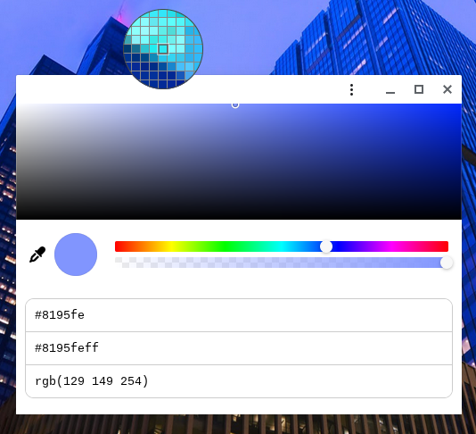

# Basic Color Picker
A very simple PWA you can install on any platform for just quickly picking a color whenever you need.

## Install
Just go to https://el1s7.github.io/basic-colorpicker/, and click the install button on the bar.